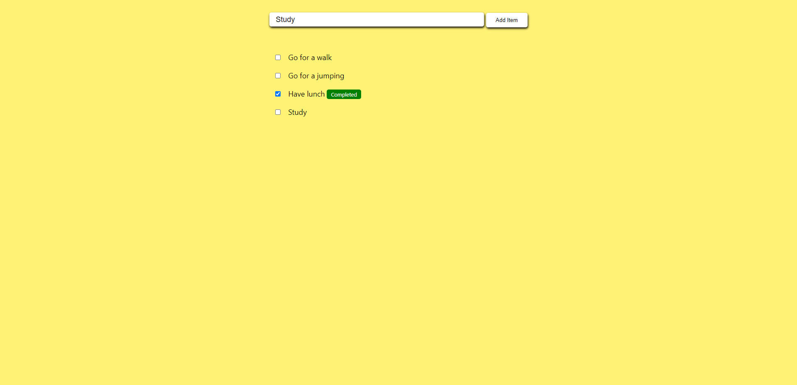

# Assignment - 13 (Todo List)

    This week-13 assignment covers the concepts of fundamentals of React Library by creating a basic react application called Todo List.

# Description

    This application is used to make a list of the things you are willing to work on. This projects covers the concepts of useState, useRef and fundamentals of CSS in react.

# Installation

- Fork or directly clone this repository to your local machine
- Use the `npm install` command to install dependencies
- Once the dependencies are finished installing, use the `npm start` command inside the root directory to open the app in your local browser of choice

# Demo

# Credits

[Neeraj Singh Sarathe](https://github.com/neerajsinghsarathe)

# License

MIT License